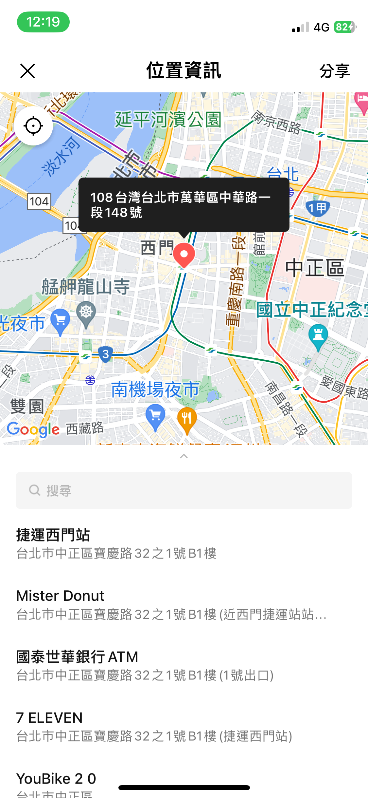
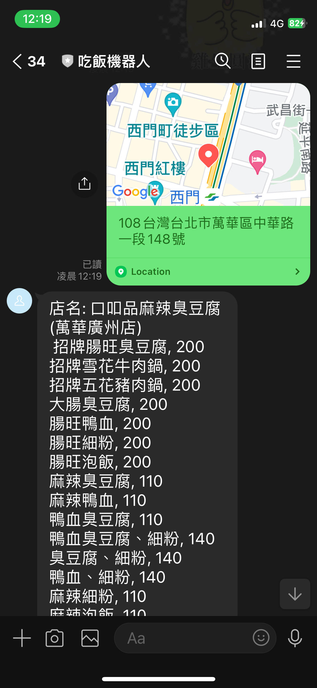

# 吃飯機器人

發送位置訊息給此Line機器人，它會找到該位置附近隨機一家餐廳，並展示該家餐廳的菜單。

## 安裝方法

1. 搜尋line帳號`@402uhghb`，並加入好友
2. 掃描以下QR Code，並加入好友

## 使用方法

1. 點開輸入框最左邊的+號，並點選位置資訊

2. 點選要分享的位置

3. 機器人會回傳一家餐廳的菜單

## 參考資源

[在 Render 搭建 Line Bot](https://rnnnnn.medium.com/在-render-搭建-line-bot-92b35bedb24e)

[[Python爬蟲實例] 教你爬取"foodpanda"餐飲外送平台](https://blog.jiatool.com/posts/foodpanda_spider/#取得餐廳基本資料與菜單)